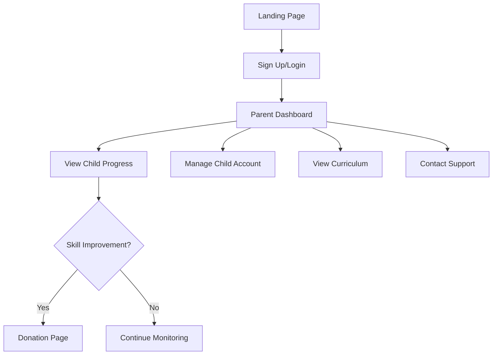
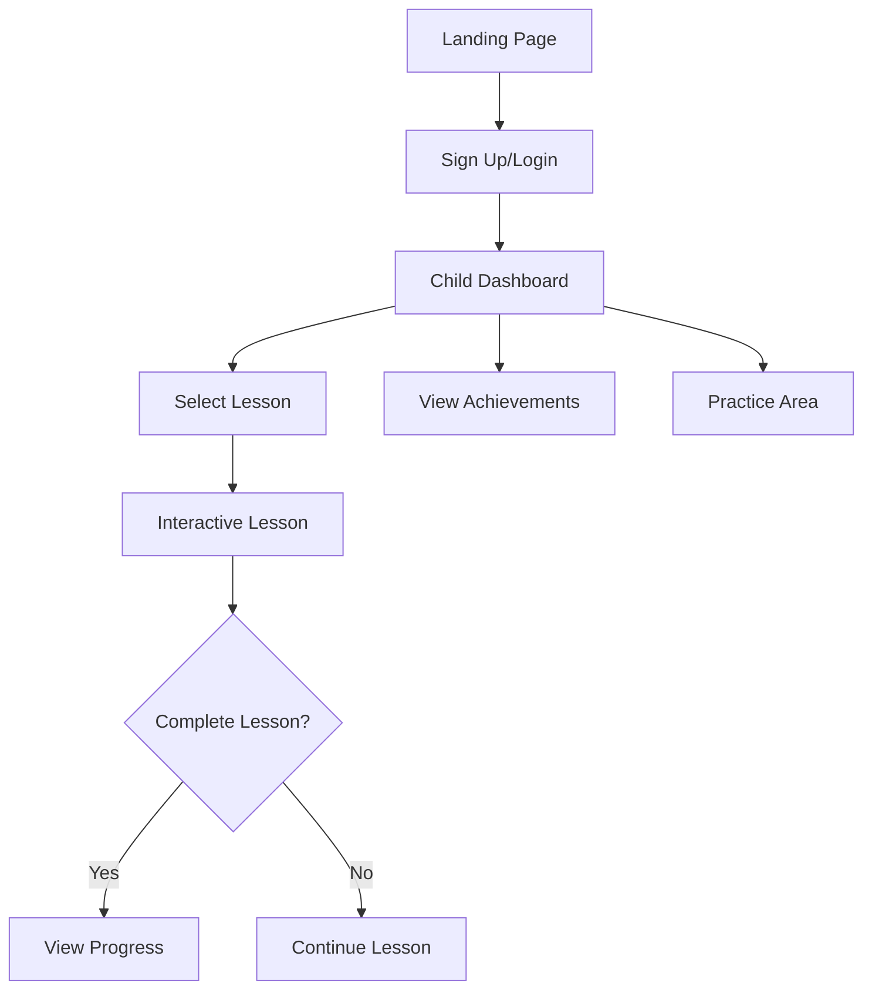
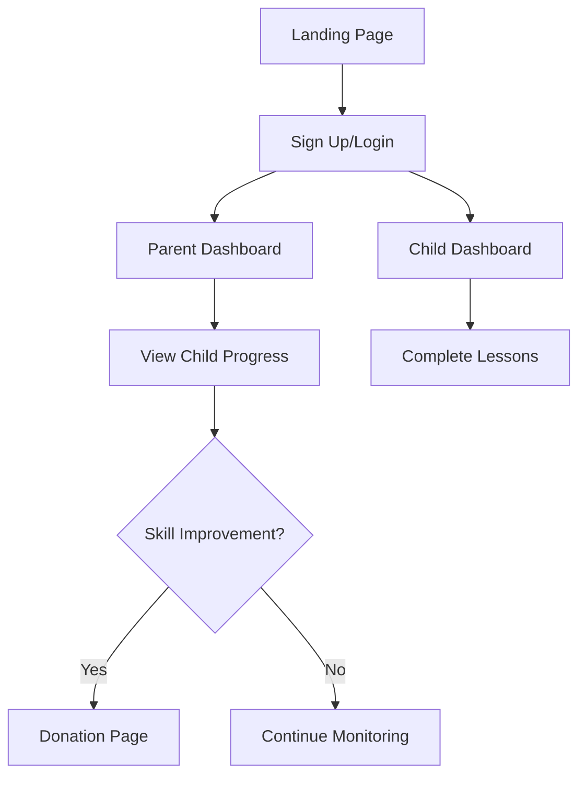
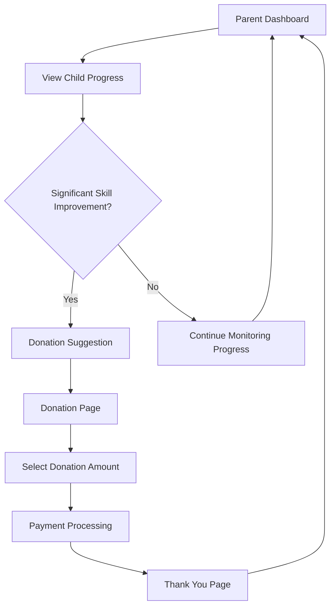

# User Flows for Kids After School

## Parent User Journey

## Child User Journey

## Common Paths

## Donation Flow Integration

## Key Features

1. **Parent Dashboard**
   - Quick access to child progress
   - Donation prompts based on skill improvement
   - Account management
   - Curriculum overview

2. **Child Dashboard**
   - Lesson selection
   - Progress tracking
   - Achievement display
   - Practice area

3. **Shared Features**
   - Responsive navigation
   - Clear progress indicators
   - Seamless transitions between parent/child views
   - Integrated donation flow
